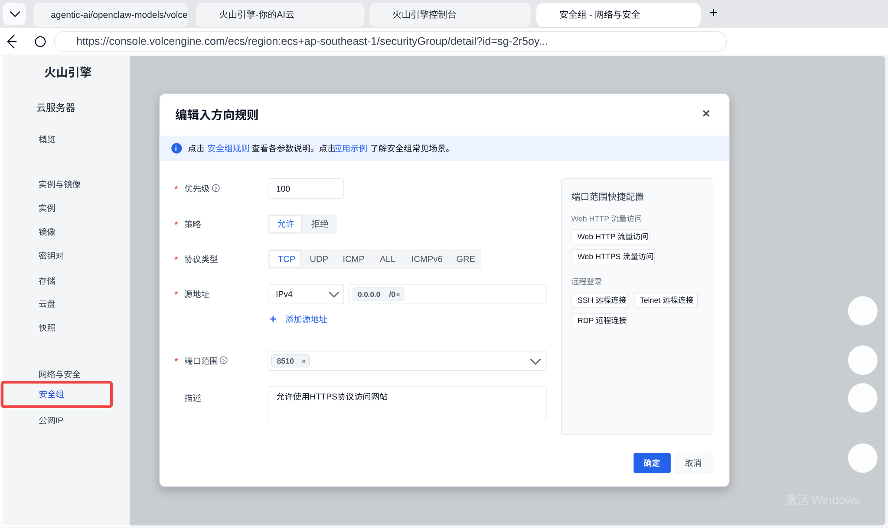

# Morning Newspaper Skill 定时早报交接

目标很简单：让龙虾每天准时生成 AI 早报，并在当前渠道发出一条消息，消息里包含前三条看点和完整页面链接。

我们只分两件事：

- **给龙虾做**：clone 项目、使用 skill、每天定时生成早报、在当前渠道发送摘要和链接。
- **我们手动做**：在火山云网页控制台放行页面端口，让早报页面能被公网打开。

---

## 1. 直接发给龙虾的指令

把下面这段发给龙虾即可。

```text
请从 GitHub 拉取并使用这个 OpenClaw skill，每天定时生成 AI 早报，并把结果发到当前渠道。

仓库地址：git@github.com:lemons101/Morning-Newspaper-Manager.git
HTTPS 备用地址：https://github.com/lemons101/Morning-Newspaper-Manager.git
主 skill 路径：skills/information-collector-skill

请不要只复制 skill 子目录，必须 clone 完整仓库。

初始化步骤：
1. mkdir -p /root/projects
2. cd /root/projects
3. git clone git@github.com:lemons101/Morning-Newspaper-Manager.git
4. cd /root/projects/Morning-Newspaper-Manager
5. python3 -m venv .venv
6. source .venv/bin/activate
7. pip install -r requirements.txt
8. 如果要接入邮箱告警，请在仓库根目录配置 .env，填入 IMAP_USER 和 IMAP_PASS

默认项目目录是：/root/projects/Morning-Newspaper-Manager。
如果你把项目放在别的目录，请把下面所有命令里的 /root/projects/Morning-Newspaper-Manager 都替换成实际目录。

每日生成命令：
cd /root/projects/Morning-Newspaper-Manager
export MORNING_NEWSPAPER_PROJECT_ROOT=/root/projects/Morning-Newspaper-Manager
export DISPLAY_REWRITE_MODEL=hotai/gpt-5.4
bash scripts/run_daily_newspaper.sh /root/projects/Morning-Newspaper-Manager

请设置为每天北京时间 08:00 自动执行。

执行成功后，请读取生成结果里的 Top10 前三条，向当前渠道发送一条中文早报消息。消息必须包含：
1. “今日 AI 早报已更新”
2. 前三条看点：每条包含标题和一句话摘要
3. 完整页面链接：http://101.47.152.44:8510/dashboard.html

发送要求：
- 发到当前渠道，不要换频道、不要另开对话、不要发到邮件。
- 如果当天生成失败，也要在当前渠道说明失败原因和需要人工处理的点。
```

---

## 2. 龙虾每天要发出的消息格式

建议让龙虾每天发这样的格式：

```text
今日 AI 早报已更新

今日前三条：
1. <标题一>
   <一句话摘要一>
2. <标题二>
   <一句话摘要二>
3. <标题三>
   <一句话摘要三>

完整早报：
http://101.47.152.44:8510/dashboard.html
```

如果换了服务器或端口，只改最后这个链接即可：

```text
http://<服务器公网IP或域名>:<端口>/dashboard.html
```

---

## 3. 定时任务建议

让龙虾按每天北京时间 08:00 生成早报。

如果龙虾需要 cron，可用：

```cron
0 8 * * * cd /root/projects/Morning-Newspaper-Manager && MORNING_NEWSPAPER_PROJECT_ROOT=/root/projects/Morning-Newspaper-Manager DISPLAY_REWRITE_MODEL=hotai/gpt-5.4 bash scripts/run_daily_newspaper.sh /root/projects/Morning-Newspaper-Manager >> runtime/daily.log 2>&1
```

生成完成后，龙虾再把前三条和页面链接发到当前渠道。

---

## 4. 我们手动配置页面端口

页面链接当前使用：

```text
http://101.47.152.44:8510/dashboard.html
```

这里的 `8510` 是页面端口。我们需要在火山云控制台手动放行它。

火山云操作路径：

```text
火山云控制台
-> 云服务器 ECS
-> 找到对应服务器实例
-> 安全组
-> 入方向规则
-> 添加规则
```

填写规则：

| 项目 | 填写 |
| --- | --- |
| 策略 | 允许 |
| 协议类型 | TCP |
| 源地址 | `0.0.0.0/0`，或只允许固定 IP |
| 端口范围 | `8510` |
| 描述 | Morning Newspaper dashboard |

示意图：



如果以后端口从 `8510` 改成 `8520`，那四个地方都要一起改：

```text
火山云安全组端口
服务器防火墙端口
Python 静态服务端口
最终页面链接里的端口
```

---

## 5. 服务器页面服务

在服务器上用 Python 静态服务开放页面：

```bash
cd /root/projects/Morning-Newspaper-Manager/runtime
python3 -m http.server 8510 --bind 0.0.0.0
```

如果系统防火墙开启了，也放行同一个端口：

```bash
sudo ufw allow 8510/tcp
```

或：

```bash
sudo firewall-cmd --permanent --add-port=8510/tcp
sudo firewall-cmd --reload
```

检查页面是否能打开：

```text
http://101.47.152.44:8510/dashboard.html
```

---

## 6. 邮箱接入配置

邮箱接入是给早报增加“重要邮件/会议/截止事项提醒”的，不是用来发送早报消息。早报最终仍然由龙虾发到当前渠道。

当前项目默认按 163 邮箱配置：

```text
IMAP：imap.163.com:993
POP3 备用：pop.163.com:995
```

我们需要先在 163 邮箱网页里做一次手动配置：

```text
登录 163 邮箱
-> 设置
-> POP3/SMTP/IMAP
-> 开启 IMAP/SMTP 服务
-> 如需备用，也开启 POP3/SMTP 服务
-> 生成客户端授权码
```

注意：`IMAP_PASS` 填的是 163 邮箱生成的客户端授权码，不是邮箱登录密码。

然后在服务器 clone 出来的仓库根目录创建 `.env`：

```bash
cd /root/projects/Morning-Newspaper-Manager
cp .env.example .env
```

编辑 `.env`：

```text
IMAP_USER=你的163邮箱地址
IMAP_PASS=你的163邮箱授权码
```

例如：

```text
IMAP_USER=example@163.com
IMAP_PASS=xxxxxxxxxxxxxxxx
```

配置好后不用在 cron 里额外写这两个变量，项目启动时会自动读取仓库根目录的 `.env`。

邮箱接入成功后，早报生成链路会自动扫描最近邮件，把命中 urgent / important / meeting / deadline / reminder 等关键词的邮件纳入提醒。

如果不想接入邮箱，有两种做法：

```text
不配置 IMAP_USER / IMAP_PASS，邮件源会自动跳过
或在 config/sources.yaml 里把 executive_mailbox 的 enabled 改成 false
```

排查重点：

```text
如果日志里出现 missing user env：检查 IMAP_USER
如果日志里出现 missing password env：检查 IMAP_PASS
如果 IMAP 登录失败：检查是否用了授权码，而不是登录密码
如果 IMAP 不通：确认 163 邮箱已开启 IMAP/SMTP 服务
```

---

## 7. 最小验收

龙虾侧验收：

```text
每天北京时间 08:00 能自动运行早报生成命令
每天生成后能在当前渠道发送消息
消息里有前三条看点
消息里有完整页面链接
失败时能在当前渠道说明失败原因
```

我们手动配置侧验收：

```text
http://101.47.152.44:8510/dashboard.html 能打开
```
