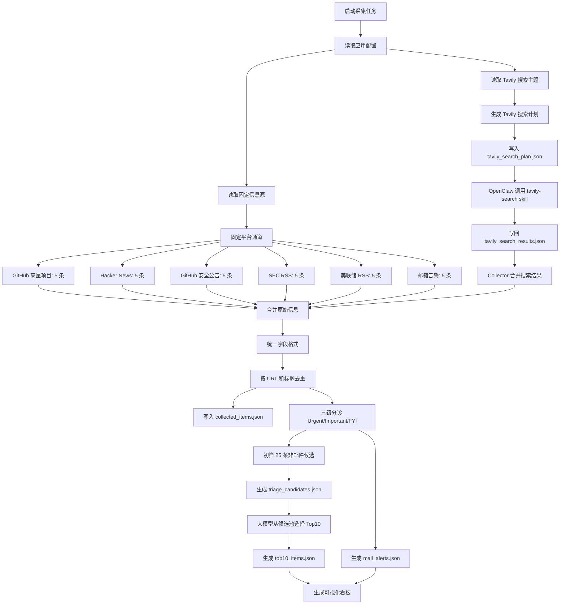

# Information Collector 任务流

## 目标

构建一个可复用的信息采集层：围绕 AI 最新技术、AI Agent、AI 商业化和企业采用信号，从固定平台、OpenClaw/Tavily 搜索和邮箱告警中收集信息碎片，统一输出干净 JSON，供后续早报、看板和分诊使用。

## 端到端流程

## 三条采集通道

### 固定平台通道

这条通道是确定性的。我们显式维护信息源列表、凭据和每个来源的上限。

默认固定来源：

- GitHub 高星项目搜索
- GitHub Security Advisories API
- Hacker News Top Stories
- SEC Press Releases RSS
- Federal Reserve RSS
- 邮箱紧急和重要告警

每个启用来源默认最多保留 5 条。

### OpenClaw 搜索通道

这条通道是探索性的。OpenClaw 根据配置主题调用 `tavily-search` skill，并结合域名提示搜索 AI 前沿技术、AI Agent、开源工具、商业化和融资产品信息。

每个主题默认最多保留 5 条。

Python 采集器不直接调用 Tavily API。它只负责生成 `runtime/tavily_search_plan.json`，并读取 OpenClaw 回填的 `runtime/tavily_search_results.json`。

### 邮件告警通道

邮箱只输出命中紧急或重要关键词的邮件，不占用 25 条初筛候选名额，也不占用 Top10 资讯名额，而是在看板中单独展示。

邮箱未来事项采用队列结构：新邮件中识别出的会议、截止、审批和提醒会写入 `runtime/mail_event_queue.json`。早报每天只输出当天到期的队列事项；未来事项先保留，过期事项自动丢弃，避免每天重复展示同一封旧邮件。

## 分诊与 Top10 选择

分诊分成两层：

1. 规则初筛：根据优先级、影响分、置信度和发布时间，从非邮件资讯中选出 25 条候选，写入 `runtime/triage_candidates.json`。
2. 大模型精选：后续由 OpenClaw/大模型阅读这 25 条候选，结合 AI 技术价值、商业信号强度、新鲜度和行动价值，选出最终 Top10。

当前版本的大模型精选位暂时使用规则排序兜底，所以 `runtime/top10_items.json` 一定来自 25 条候选池。

## 当前版本已实现

- 多来源采集
- 统一字段结构
- 基础去重
- Urgent / Important / FYI 三级分诊
- 25 条候选池初筛
- Top10 资讯筛选
- 邮件告警拆分
- Streamlit 动态看板
- 静态 HTML 看板兜底
